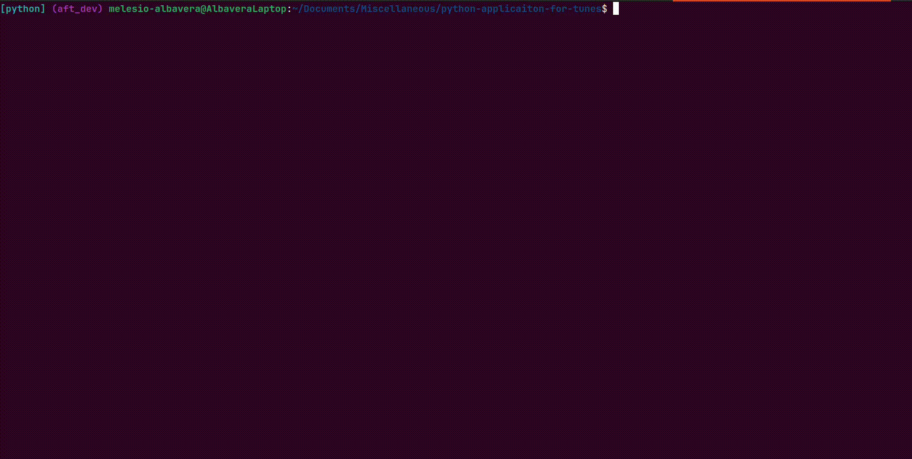

# Application For Tunes

This script was written in order to aid in building my personal playlist.
It utilizes Spotify A.P.I. for metadata content and uses the Invidious A.P.I.
to provide the U.R.L. audio source(s).



## Installing Dependencies

While there are many ways to skin the cat per say, we reccomend using
the [Mamba](https://github.com/mamba-org/mamba) project for quick and frictionless experience. After installing [miniforge](https://github.com/conda-forge/miniforge)
use the included `enviroment.yaml` file to create the python enviroment using the following
command:

```
mamba env create --file enviroment.yaml 
```

Assuming there are no errors, then run:

```
mamba activate aft_dev
```

And you should be good to go!

## Usage

Begin by cloning the repository to your local machine.

### Spotify Credentials

Before running the script, you need to provide valid Spotify application credentials in order
to make calls to the Spotify A.P.I.:
1. Begin by creating a Spotify Developer Account [here](https://developer.spotify.com/).
2. Once you have logged in, go to the [Developer Dashboard](https://developer.spotify.com/dashboard) and create a new application. Be sure to select the tickbox labeled "Web API".
3. Wait a bit for your application to be approved. Once that happens, open the application settings. Here you should be able to see both your Client ID and a Client Secret.

Finally, create a `.env` file in the project repository structured as follows:

```
spotify_id=[REPLACE EVERYTING AFTER EQUAL SIGN WITH CLIENT ID]
spotify_secret=[REPLACE EVERYTING AFTER EQUAL SIGN WITH CLIENT SECRET]
```

### Running the Script

The script can be run with the following command:

```
python aft.py
