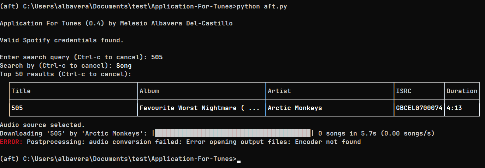

# Application For Tunes

This script was written in order to aid in building my personal playlist.
It utilizes Spotify A.P.I. for metadata content and uses the Invidious A.P.I.
to provide the U.R.L. audio source(s). It uses the [yt-dlp](https://github.com/yt-dlp/yt-dlp) video downloader
and appends the corresponding metadata adhereing to the [ID3tag standard](https://mutagen-specs.readthedocs.io/en/latest/id3/id3v2.4.0-structure.html).


## Installing Dependencies

While there are many ways to skin the cat per say, we reccomend using
the [Mamba](https://github.com/mamba-org/mamba) project for quick and frictionless experience.
Specifically, this guide assumes you install the [miniforge](https://github.com/conda-forge/miniforge) option.
After installing, open an Unicode-enabled terminal (Miniforge Prompt is included 
with miniforge on Windows) and begin by cloning the repository
to your machine (assuming SSH, which you can set up by 
following [this](https://docs.github.com/en/authentication/connecting-to-github-with-ssh/adding-a-new-ssh-key-to-your-github-account) tutorial) and entering the resulting directory using:

```
git clone git@github.com:me11203sci/Application-For-Tunes.git 
cd Application-For-Tunes/
```

then use the included `enviroment.yaml` file to create the python enviroment using the following
command:

```
mamba env create --file enviroment.yaml 
```

Assuming there are no errors, then run:

```
mamba activate aft
```

And you should be good to go!

## Usage

Ensure that the repository is cloned to your local machine, then proceed.

### Spotify Credentials

Before running the script, you need to provide valid Spotify application credentials in order
to make calls to the Spotify A.P.I.:
1. Begin by creating a Spotify Developer Account [here](https://developer.spotify.com/).
2. Once you have logged in, go to the [Developer Dashboard](https://developer.spotify.com/dashboard) and create a new application. Any link should work for the Redirect U.R.I., it is not important for our purposes. Be sure to select the tickbox labeled "Web API".
3. Wait a bit for your application to be approved. Once that happens, open the application settings. Here you should be able to see both your Client ID and a Client Secret.

Finally, create a file named `.env` in the project repository structured as follows:

```
spotify_id=[REPLACE EVERYTING AFTER EQUAL SIGN WITH CLIENT ID]
spotify_secret=[REPLACE EVERYTING AFTER EQUAL SIGN WITH CLIENT SECRET]
```

### Running the Script

The script can be run with the following command:

```
python aft.py
```

#### Note for Windows Users

Some Windows users may encounter the following error:



This is a known [issue with ffmpeg](https://github.com/yt-dlp/yt-dlp/issues/871#issuecomment-911701285) and the solution is to run the included batch
file, `install_patched_ffmpeg.bat` (**REMEMBER:** run this while the `aft` python enviroment 
is active.)
